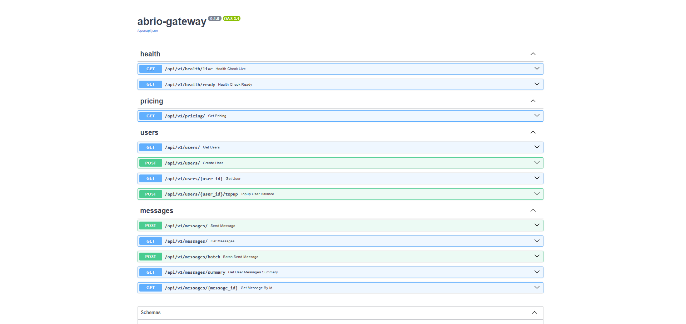
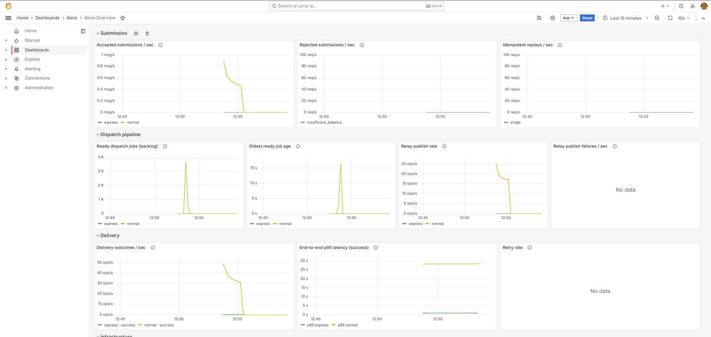

# abrio

Multi-tenant SMS gateway for idempotent message submission, credit reservation, transactional outbox dispatch, priority queues, fair task distribution, and safe retries.




## Run

```bash
docker network create abrio-network
docker compose up --build
```

- API docs: http://localhost:8000/docs
- Health check: http://localhost:8000/api/v1/health/ready

## Test

```bash
uv sync --dev
uv run pytest src/tests/unit
docker compose up -d postgres redis rabbitmq
uv run pytest
```

## Load & Benchmark

With the stack running:

```bash
uv run python scripts/loadtest.py      # correctness under pressure
uv run python scripts/benchmark.py     # throughput and latency report
```

Rate limiting is disabled by default so these scripts measure storage,
dispatch, and credit behavior without ingress throttling.

Tune with env vars:

```bash
HOT_COUNT=4000 uv run python scripts/loadtest.py
uv run python scripts/benchmark.py
```

## Docs

See [docs](docs/) for architecture, invariants, dispatch flow, and scaling notes.
